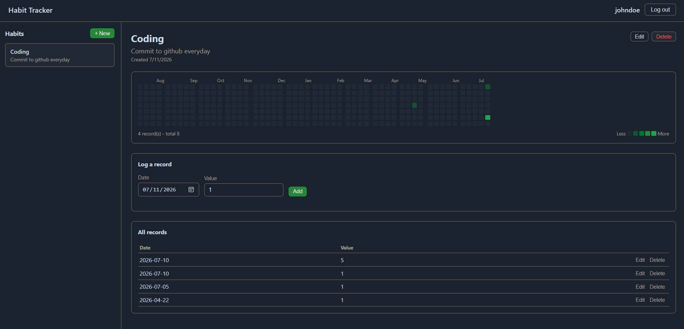

# Habit Tracker

A habit tracking application with a FastAPI backend and a lightweight vanilla JavaScript frontend. Habits are visualized on a GitHub-style contribution calendar, colored by how much was logged each day, with a full interface for managing habits and their records.



## Features

- User registration and authentication (JWT bearer tokens)
- Create, edit, and delete habits
- Log records (date + numeric value) against a habit
- A habit may have multiple records on the same day; values are summed for that day
- Contribution-graph calendar per habit, with a click-to-edit day view
- Full CRUD for habits and records, both from the web UI and the REST API directly

## Tech Stack

**Backend:** FastAPI, SQLAlchemy, SQLite, Pydantic, PyJWT, pwdlib (argon2 password hashing)

**Frontend:** HTML, CSS, and vanilla JavaScript with no build step, served as static files directly by FastAPI

**Tooling:** [uv](https://github.com/astral-sh/uv) for dependency management

## Requirements

- Python 3.13+
- uv

## Setup

```
uv sync
```

## Running

```
uv run fastapi dev app/main.py
```

This serves both the API and the web UI at `http://127.0.0.1:8000`. A SQLite database is created automatically on first run at `app/database/dev.db`.

Alternatively, with uvicorn directly:

```
uv run uvicorn app.main:app --reload
```

## Usage

1. Open `http://127.0.0.1:8000` in a browser.
2. Register a username and password.
3. Create a habit.
4. Log records against the habit by date and value. The calendar updates automatically; darker cells indicate a higher total value logged that day.

## Project Structure

```
app/
  main.py            FastAPI app setup: middleware, routers, static file mounting
  config.py           Database path and secret key configuration
  dependencies.py      Shared dependencies: DB session, current-user resolution
  database/
    database.py        SQLAlchemy engine, session factory, table initialization
  models/
    models.py           ORM models: User, Habit, HabitRecord
  schemas/                Pydantic request/response models
  routers/                API route definitions (users, habits, habit_records)
  services/               Business logic and database access
  static/                 Frontend: index.html, styles.css, app.js
```

## API Reference

All endpoints other than registration and login require a bearer token:
`Authorization: Bearer <token>`

### Auth

| Method | Path                | Description                              |
|--------|---------------------|------------------------------------------|
| POST   | /users/create_user  | Register a new user                      |
| POST   | /users/token        | Log in, returns an access token           |
| GET    | /users/user/me/     | Get the current authenticated user        |

### Habits

| Method | Path                     | Description                          |
|--------|--------------------------|---------------------------------------|
| POST   | /habits/create_habit     | Create a habit                        |
| GET    | /habits/get_all          | List habits for the current user      |
| GET    | /habits/{habit_id}       | Get a single habit                    |
| PUT    | /habits/{habit_id}       | Update a habit                        |
| DELETE | /habits/{habit_id}       | Delete a habit and its records        |

### Habit Records

| Method | Path                          | Description                     |
|--------|-------------------------------|-----------------------------------|
| POST   | /habit_records/create         | Create a record                   |
| GET    | /habit_records/{habit_id}     | List records for a habit          |
| PUT    | /habit_records/{record_id}    | Update a record                   |
| DELETE | /habit_records/{record_id}    | Delete a record                   |

Interactive API documentation is available at `/docs` while the server is running.

## Data Model

- A **User** has many **Habits**.
- A **Habit** has many **HabitRecords**.
- A **HabitRecord** stores a date and a numeric value. Multiple records may share the same date and habit; the calendar view sums them, which supports habits logged more than once a day.

## Known Limitations

- The JWT secret key is defined in `app/config.py` rather than sourced from an environment variable. Replace it with an environment-provided secret before any shared or production deployment.
- No password complexity rules or email verification.
- SQLite is used as a single-file database, suitable for local or personal use rather than concurrent multi-user deployments.
